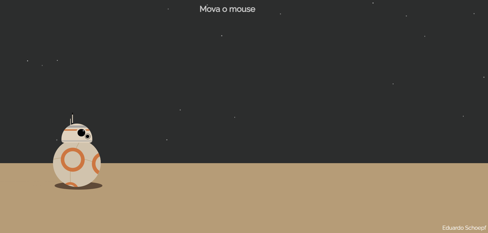

# 🤖✨ BB-8 Droid  

Para fãs de Star Wars e entusiastas de desenvolvimento front-end, este projeto é uma animação interativa que recria o droide BB-8 da saga Star Wars, utilizando **HTML, CSS e JavaScript** .

O BB-8 segue o movimento do cursor, respondendo de forma dinâmica, criando uma experiência imersiva!  

>[Você pode testar clicando aqui](https://eduardoschoepf.github.io/bb-8/).  

  
Inspirado no trabalho incrível de [mdixondesigns](https://mdixondesigns.github.io/).   